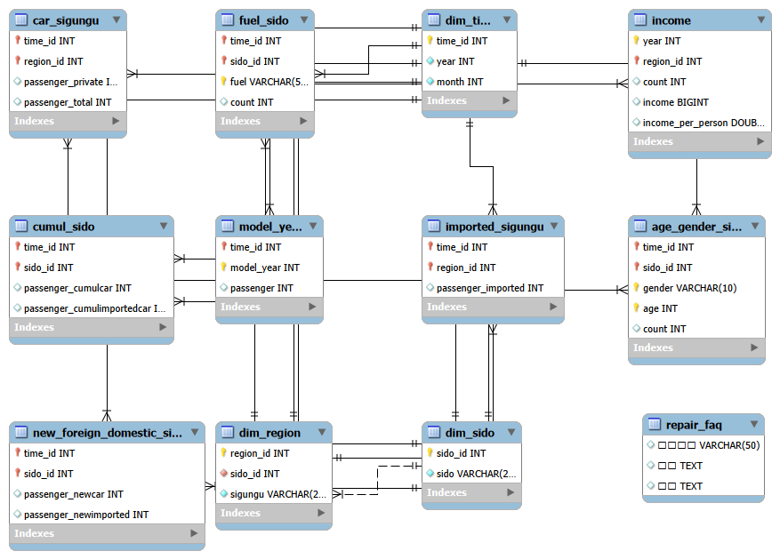
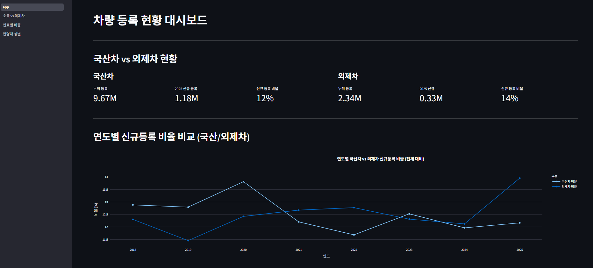
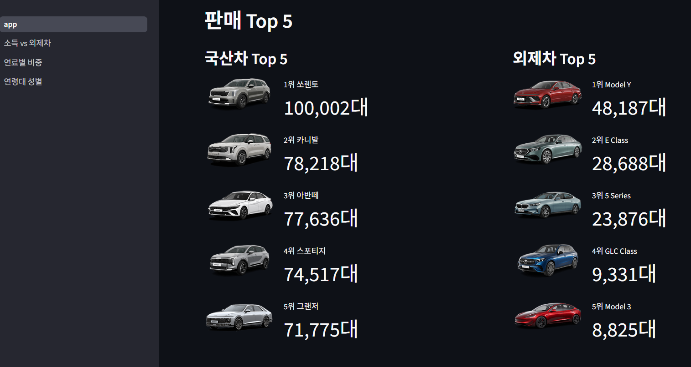
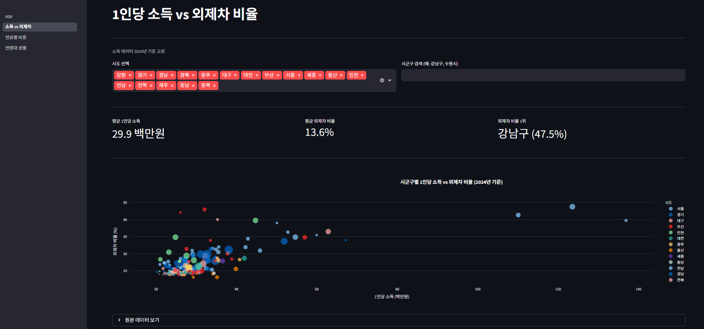
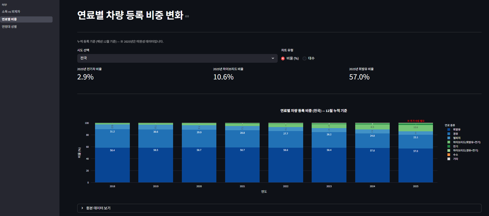
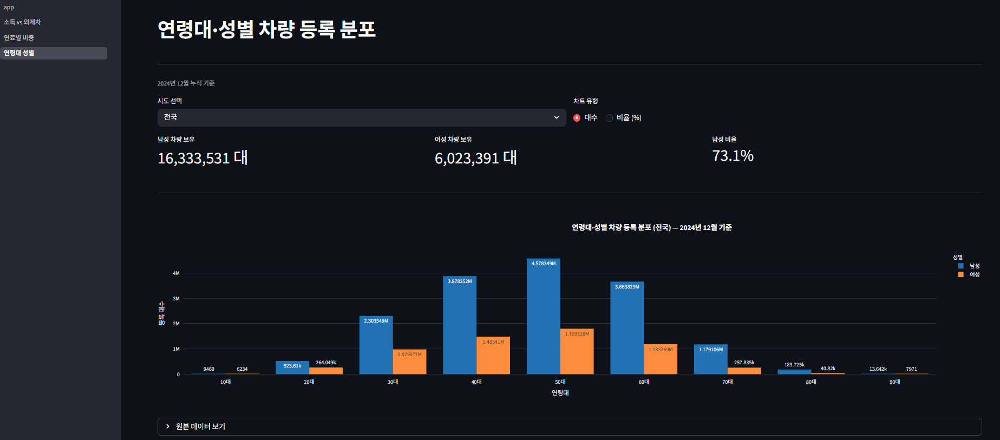
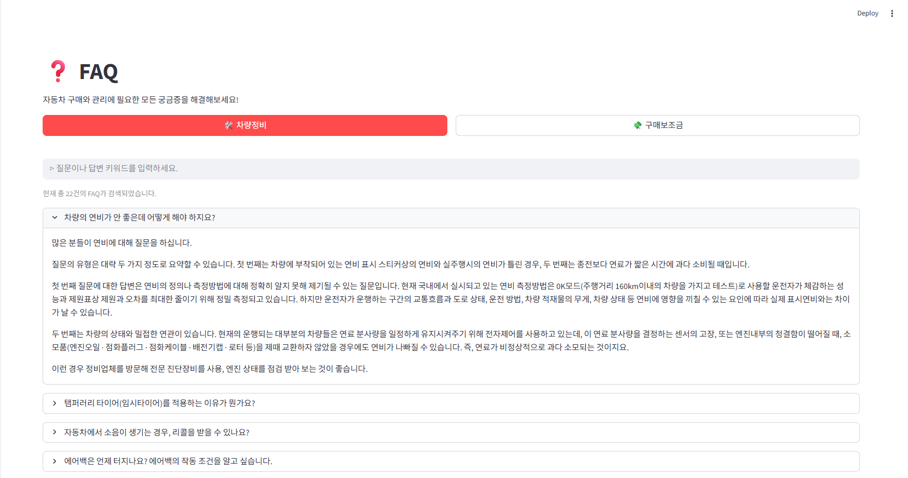
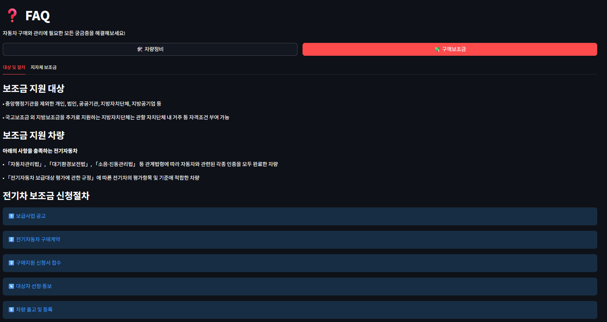
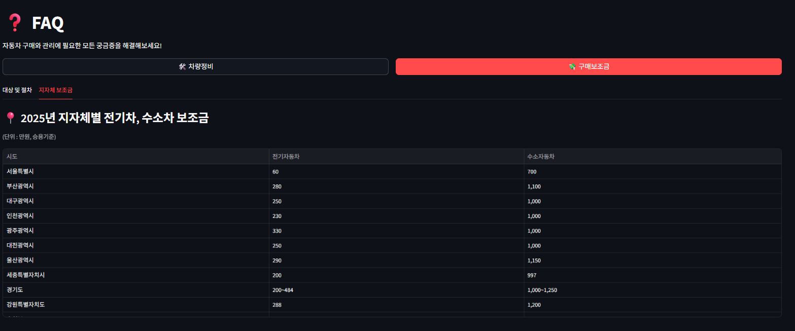

# 자동차 시장 분석 및 의사결정 지원 플랫폼

### 지역, 소득, 연령 데이터를 사용하여 시장 트랜드 및 소비자 인사이트 제공

## 팀 소개
팀원 : 김재홍, 김지훈, 정영석, 김정민

## 개발 기간
2026.03.25 - 2026.03.31(총 7일)

---
## 프로젝트 개요

## 1. 주제
차량 등록 및 구매 데이터를 기반으로, 사용자에게 **시장 트렌드** 와 **인사이트**를 제공
- 지역, 인구, 성별, 연령데 기반 데이터를 바탕으로 시장 현황과 소비자 특성을 분석하고 시각화

## 2. 선정 배경
- **정보의 분산** : 차량 구매 시장은 **지역, 소득 수준, 연령, 성별 등 다양한 요인에 의해 영향**을 받지만 각각의 데이터가 따로 존재
- **직관적인 정보 부족** : 기존 정보는 단순 통계나 나열 중심 제공 시각화 가능 데이터의 부재
- **합리적 의사결정의 어려움** : 차량 구매시 개개인의 감과 다른 사람을 통한 객관적이지 못한 정보에 의존

## 3. 프로젝트 목표
이에 본 서비스는 **차량 등록 데이터와 인구·소득 데이터를 결합**하여,

1. **연도별 차량 구매 추이 및 브랜드 순위**
2. **지역·소득·연령·성별 기반 차량 보유 및 등록 패턴**
3. **차량 정비 및 친환경차 보조금 관련 FAQ**
를 **통합 제공**한다.

## 4. 기대효과
사용자는 이를 통해 **차량 시장 흐름과 소비 패턴**을 **직관적으로 이해**하고, **데이터에 기반**한 **합리적인 차량 구매 및 의사결정**을 **수행**할 수 있다.
---

## 기술 스택 
- LANGUAGE : Python 3.13.12
- Database : MySQL
- Web Framework : Streamlit
- Visualization : Plotly, Pandas, Matplotlib

## 사용한 데이터
- 국토교통부 국토교통 통계누리-자동차등록현황보고(https://stat.molit.go.kr/portal/cate/statView.do?hRsId=58) 
- 다나와 차량 판매 실적(https://auto.danawa.com/)
- 국세청 국세통계센터 (https://tasis.nts.go.kr/websquare/websquare.html?w2xPath=/cm/index.xml ) 
- 무공해차 통합누리집(https://ev.or.kr/nportal/main.do) 
- 현대자동차 차량정비(https://www.hyundai.com/kr/ko/e/customer/center/faq)

## 파일구조
```
project/
└── SKN29-1st-2team-main/
    ├── data/                      # 분석용 원본 데이터
    │   ├── 00.income_sigungu_yearly.csv
    │   ├── 01.car_sido_monthly.csv
    │   ├── 02.car_sigungu_monthly.csv
    │   ├── 03.car_importedcar_sigungu_monthly.csv
    │   ├── 04.car_sido_culmulagegender_totmonthly.csv
    │   ├── 10.car_fuel_sido_totmonthly.csv
    │   ├── 15.car_culmulmodyear_totmonthly.csv
    │   ├── 20.car_sido_newreg_totmonthly.csv
    │   └── 21.car_sido_newcumulcartotmonthly.csv
    │
    ├── images/                    # 시각화 이미지 및 결과물
    │   ├── 1-1.main.png
    │   ├── 1-2.top5.png
    │   ├── 2-1.income.png
    │   ├── 2-2.fuel.png
    │   ├── 2-3.agegender.png
    │   ├── 3-1.FAQ1.png
    │   ├── 3-2.FAQ2.png
    │   └── 3-3.FAQ3.png
    │
    ├── pages/                     # Streamlit 페이지별 기능 구현
    │   ├── 1소득vs외제차.py
    │   ├── 2연료별비중.py
    │   ├── 3연령대성별.py
    │   └── 4_FAQ.py
    │
    ├── 01_create_db.py            # DB 생성 스크립트
    ├── 02_load_data.py            # 데이터 적재 스크립트
    ├── 03_load_faq_data.py        # FAQ 데이터 적재
    ├── app.py                     # 메인 Streamlit 앱 실행 파일
    ├── db_manager.py              # DB 연결 및 관리 모듈
    │
    ├── README.md                  # 프로젝트 설명 문서
    └── .gitignore                 # Git 제외 파일 설정
```

## 데이터베이스 구조


## 프로젝트 시연









## 기대 효과
- 연령대별, 지역별, 연료별 차량 선호도에 대한 인사이트와 시각화 플랫폼 제공
- FAQ를 통해 차량점비와 보조금 정보 제공

## 회고
김재홍 : 첫 단위프로젝트에서 맨땅에 헤딩이란 기분을 다시 느끼게 되었습니다. 지금껏 배워온 걸 모두 응용해야만 결과가 나올 수 있었는데, 개발능력이 모자라 많은 도움이 되지 못해 팀원들에게 미안하고 고맙습니다.

김지훈 : 먼저 같이 프로젝트를 하며 전처리, 데이터베이스 구축, streamlit을 한 번 더 연습해 볼 수 있는 기회가 있어서 의미있는 시간이었다고 생각합니다. 어떤 순서로 일이 진해이 되는지 어떤 작업에 시간을 쏟아야 하는지 감을 잡을 수 있는 프로젝트였던 것 같습니다.

정영석 : 개인적으로 만져보고 싶은 데이터도 더 많았고, 구현하고 싶은 기능도 많았지만 시간 상 전부 못 담은 게 아쉽습니다.
다만 첫 프로젝트임에도 불구하고 많은 생각한 내용을 담을 수 있어서 자신감이 생겼습니다. 특히 시간이 부족함에도 고생해준 우리 팀원들에게
매우 감사함을 느낍니다.

김정민 : 1단위 기간동안 학습한 모든 내용을 직접 다루어보며 우리팀만의 서비스를 구현해봤다는 점이 인상 깊었습니다. 처음에는 개발 프로세스 조차도 잘 이해하지 못해 많은 시간을 투자했는데, 팀원분들과 여러 차례 회의를 거치며 프로젝트를 구체화 시키다보니 점점 방향을 잡아갈 수 있었습니다. 또한 개인적으로 아직 데이터를 다루는 능력이 부족하다는 점을 알게 되어 앞으로 남은 프로젝트를 진행하며 발전시켜보고 싶습니다.
